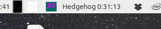
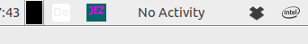

# Hedgehog
### A Mate Indicator for Hamster
This is an indicator for the Hamster GNOME Timetracker. (https://github.com/projecthamster/hamster)
Hamster brings its Gnome Shell Extension which shows whether your time is actually tracked for a project and how long you have been working 
at ths project.
Unfortunately no applet or indicator for the Mate Desktop (https://mate-desktop.org/) existed until now. 

Hedgehog is exactly this: A Mate Indicator for the Hamster Timetracker. It is tested for Ubuntu Mate but should work with other Distributions too.

If running it shows what you are doing in the Panel:

If you aren't doing anything, it looks like this:

If you want to change or stop an activity click at the indicator. This opens a menu where you can open the Hamster App.
There you can edit your activities. 

You have to close the app to make the changes visible.

## Prereqisites
- A Linux distribution with the Mate desktop (for instance Ubuntu Mate)
- Hamster Timetracker is installed.

(On Ubuntu:    

    sudo apt install hamster-time-tracker
)

## Installation
    git clone ...
    cd hedgehog-reduced
    cp config.py.dist config.py

In config.py change the db_path and hamster_path according to your system.
It should work out of the box with Ubuntu Mate.

Start it:

    ./hedgehog-indicator.py

It makes sense to put this into the autostart configuration.

## Deinstallation
Just remove the folder and remove the autostart entry (if necessary).
